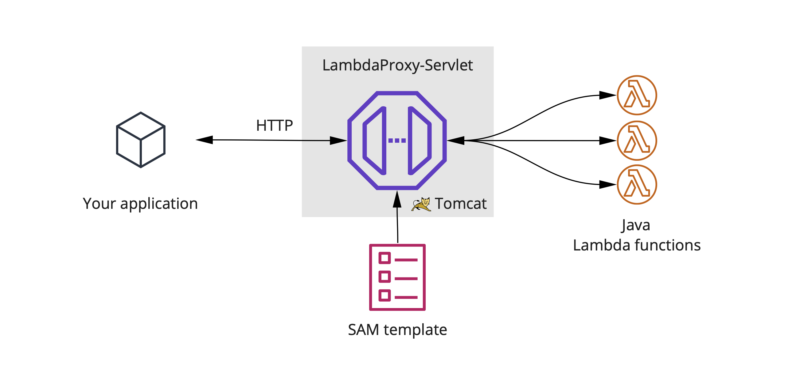

# LambdaProxy

Call your java based lambda functions within milliseconds via HTTP API with on-the-fly debugging capabilities.

_LambdaProxy_ launches a tomcat servlet that reads the API description from your `template.yaml`. When it receives
an HTTP request, it calls the respective lambda function directly by passing the required event. Each lambda function is loaded in its
own isolated ClassLoader so there is minimum interference between different lambda functions or with _LambdaProxy_ itself.

Like when executing lambda functions in AWS, each lambda instance is kept alive until it wasn't used for at least five minutes,
resulting in very short response times of your API. As _LambdaProxy_ is just a regular Java servlet, you can debug your Lambdas at any point
in time by using the remote debugger agent.

## Usage

Build your lambda application using `sam build` which should compile everything into `.aws-sam`.
 
Build `LambdaProxy` using maven:
 
     mvn clean package
     
If you don't want to compile _LambdaProxy_ yourself, just download the latest release from [here](https://github.com/0x4a616e/LambdaProxy/releases).
You can then run _LambdaProxy_ by providing the directory of your build lambda function:
 
     java -jar ./target/LambdaProxy-1.0-SNAPSHOT.jar ~/Workspace/my-lambda-function
     
 If you want to debug your lambda function, add the remote debugger agent:
  
    java -agentlib:jdwp=transport=dt_socket,server=y,address=5858,suspend=n -jar ./target/LambdaProxy-1.0-SNAPSHOT.jar ~/Workspace/my-lambda-function

When you rebuild your lambda function, `LambdaProxy` will automatically pick up the changes and reload the API.

## Comparison to `sam local start-api`

`sam local start-api` is great, but it has a few shortcomings: First of all, it is comparably slow. Whenever a new API resource
is called `sam local start-api` spins up a new Docker container to invoke the requested function. As a result, invoking
a single API method can require about a second, even on adequately equipped developer machines. If you’re using the
local API e.g., to test a frontend application that performs a substantial amount of API calls, this can become a bit annoying.

The second shortcoming is the step-by-step debugging. You can enable step-by-step debugging using the `-d` flag, but this will
cause `sam` to wait on every single API invocation until a debugger is attached. So again, if you’re working on a frontend
application that performs various API requests, this can quickly become tedious. Unlike debugging a regular Java
application, you cannot just let your application run and just put a breakpoint in on-demand during testing.